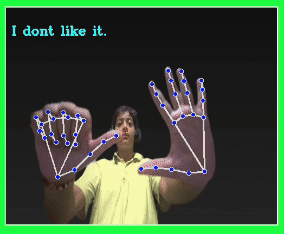

<!-- README.md -->

<h1 align="center" style="color: #4CAF50;">Include.AI - Sign Language Translator</h1>

<p align="center" style="font-size: 1.2em;">Real-time translation of sign language gestures into English text using computer vision and deep learning.</p>

<!-- Add GIF -->
<p align="center">
    
</p>

---

<h2 style="color: #f39c12;">Tech Stack</h2>
<ul style="font-size: 1.1em;">
    <li><strong>Python</strong> - Backend logic and AI integration</li>
    <li><strong>OpenCV</strong> - Computer vision for gesture detection</li>
</ul>

---

<h2 style="color: #f39c12;">How to Run</h2>

1. **Clone the repository:**

    ```sh
    git clone https://github.com/BENi-Aditya/Include.AI.git
    ```

2. **Navigate to the project directory:**

    ```sh
    cd Include.AI
    ```

3. **Create and activate a virtual environment:**

    ```sh
    python3 -m venv venv
    source venv/bin/activate  # For Windows use `venv\Scripts\activate`
    ```

4. **Install the required libraries:**

    ```sh
    pip install -r requirements.txt
    ```

5. **Run the application:**

    ```sh
    python app.py
    ```

6. **Open your web browser and navigate to:**

    ```sh
    http://localhost:5000
    ```

---

<h2 style="color: #f39c12;">Usage</h2>

<ul style="font-size: 1.1em;">
    <li>Start the application and allow camera access for real-time gesture detection.</li>
    <li>Perform sign language gestures in front of the camera.</li>
    <li>See instantaneous translation of gestures into English text on the interface.</li>
    <li>Enjoy seamless communication between sign language users and non-users.</li>
</ul>

---

<h2 style="color: #f39c12;">Features</h2>

<ul style="font-size: 1.1em;">
    <li>Real-time translation of sign language gestures into English text.</li>
    <li>Integration of computer vision for accurate gesture detection.</li>
    <li>Immediate response with low latency for natural conversations.</li>
    <li>Enhanced accessibility for users of sign language.</li>
</ul>

---

<h2 style="color: #f39c12;">Contributions</h2>
<p style="font-size: 1.1em;">Contributions are welcome to improve this project and expand its functionalities!</p>

<p style="font-size: 1.1em;">To contribute:</p>
<ul style="font-size: 1.1em;">
    <li>Fork the repository: <a href="https://github.com/BENi-Aditya/Include.AI">https://github.com/BENi-Aditya/Include.AI</a></li>
    <li>Create a new branch: <code>git checkout -b feature-branch-name</code></li>
    <li>Make your changes and commit them: <code>git commit -m 'Description of your changes'</code></li>
    <li>Push to the branch: <code>git push origin feature-branch-name</code></li>
    <li>Submit a pull request</li>
</ul>

---
